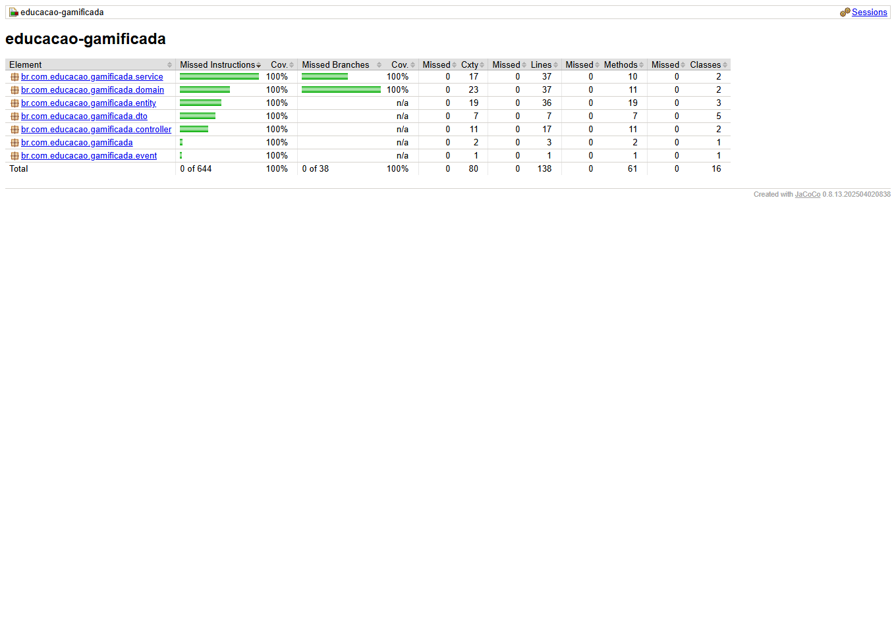
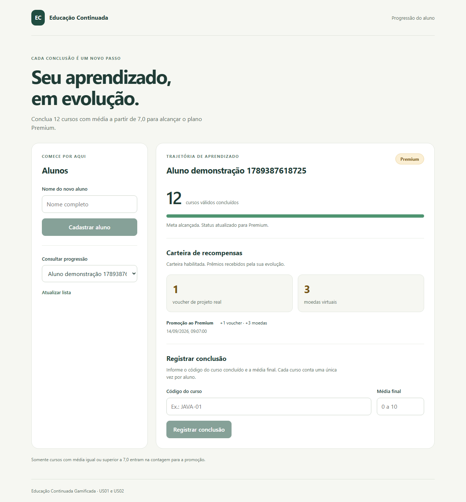
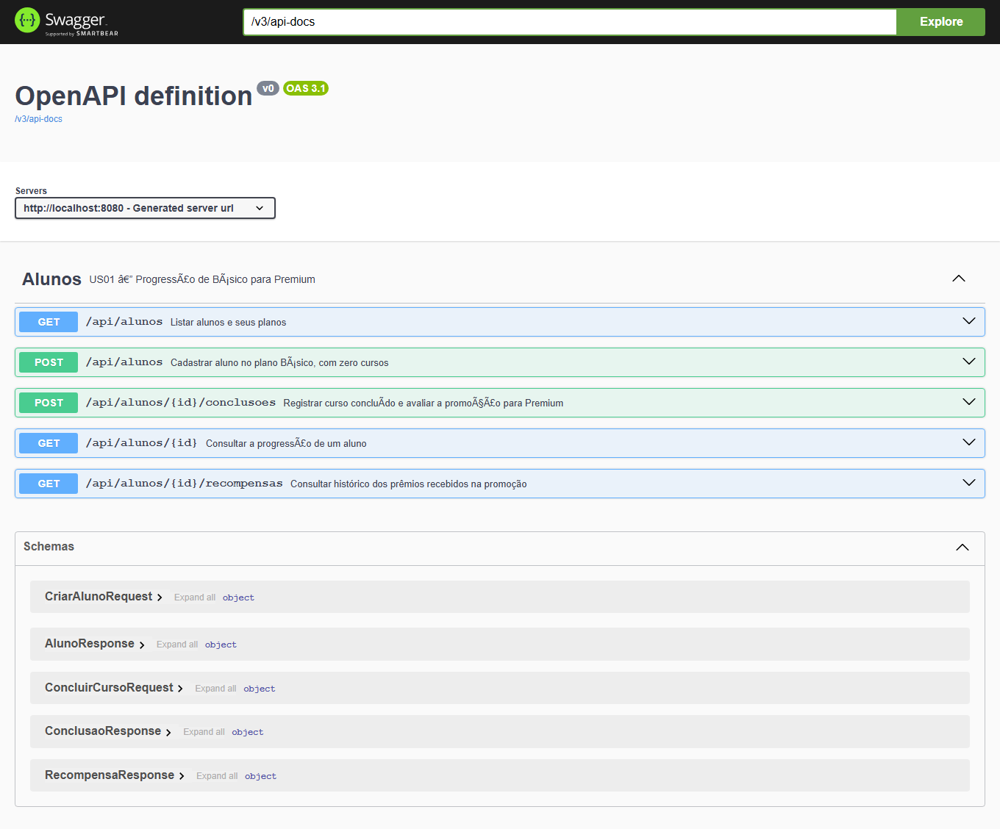
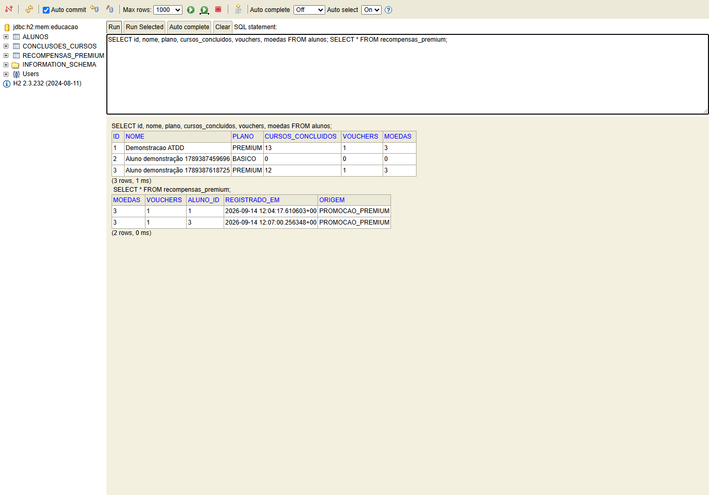

# Evidências da entrega

Execução local: **14/09/2026**, Java 17, Maven, JUnit 5, PostgreSQL 18 dedicado e H2. Capturas de navegador são reais. Nenhuma captura de IntelliJ ou Docker Desktop foi simulada.

## Testes e cobertura

- [RED JUnit US01](red/us01-junit.log) e [GREEN JUnit US01](green/us01-junit.log), reexecutados a partir dos commits históricos.

- [RED: três falhas JUnit US02](red/us02-junit.log).
- [RED: aceite HTTP e idempotência](red/us02-aceitacao.log).
- [RED: histórico da carteira ausente](red/historico-carteira.log).
- [GREEN: testes aprovados](green/us02-junit.log).
- [BLUE: 37 testes aprovados, nenhum ignorado](blue/verificacao-completa.log).
- [Relatório JaCoCo completo](blue/cobertura/index.html) e [CSV](blue/cobertura/jacoco.csv).
- [Build Vue](blue/vue-build.log) e [teste de navegador](blue/vue-e2e.log).

## Aplicação em execução

[Visualização móvel](execucao/vue-mobile.png).

[Respostas HTTP e histórico com H2](execucao/h2-http.json).

[Respostas HTTP com PostgreSQL](execucao/postgres-http.json) e [consultas SQL reais](execucao/postgres-sql.txt).

## PostgreSQL e Docker

O teste PostgreSQL executou em banco real, confirmando o produto JDBC e a persistência da promoção e dos saldos após limpar o contexto JPA. Consulte `AlunoPostgresTest` e o log BLUE.

A verificação Docker é realizada pelo job `docker` em [GitHub Actions](https://github.com/Gustavo-Champam/educacao-continuada-gamificada/actions). O artefato `docker-e-interface` contém logs, lista dos containers, consultas PostgreSQL, aceite HTTP de H2/PostgreSQL e capturas de navegador. Consulte o resultado do job antes de afirmar que o Compose foi validado.

No computador local, Docker Desktop falhou antes de iniciar o engine com `initializing Inference manager ... socket: Foi usado um endereço incompatível com o protocolo solicitado`. Os testes locais de PostgreSQL não são apresentados como execução local em container.

## IntelliJ Ultimate e Canvas

Para a comprovação específica na IDE, abrir o projeto no IntelliJ Ultimate, executar os testes históricos indicados no README e capturar o resultado do BLUE usando Run with Coverage. Os logs Maven/JUnit comprovam os resultados automatizados, mas não comprovam uso da IDE.

O link do repositório deve ser enviado pelo integrante no Canvas. Não houve postagem automática.
